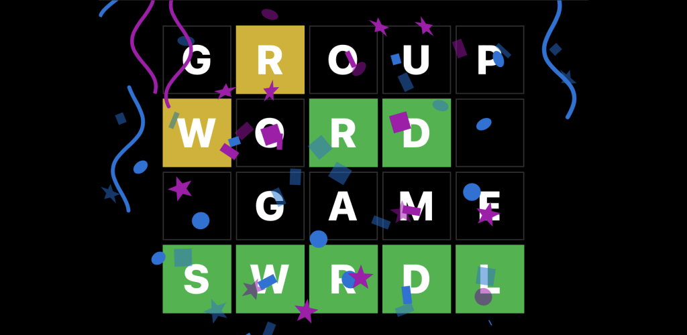

# SWRDL, the Social Word Game
A side project to learn Expo, React Native, and AWS Lambda Websockets.
Developed over the course of 6 weeks in 2022 in my free time.

SWRDL is a social word game that allows users to play with friends
and family. SWRDL is similar to Wordle, but with a social twist.
Users can create games and invite friends to play. The game allows
for customization of the rules, such as:

- Word source (dictionary or PvP)
- Game duration (continuous or daily)
- Guess feedback (letters or # of letters)
- Guess restrictions (must use known letters)
- Guess limits

Creating an account is optional but allows for recovery of games
and stats. E-mail verification is required to recover an account,
but the e-mail is not stored. The game is free to play and has no
ads.

SWRDL was available on the Google Play Store and the Apple App
Store.

## Technical Details

- SWRDL is built with Expo, React Native, and AWS.
- The game uses AWS Lambda with Websocket Gateway for real-time
  communication.
- Data is stored in MongoDB Atlas.